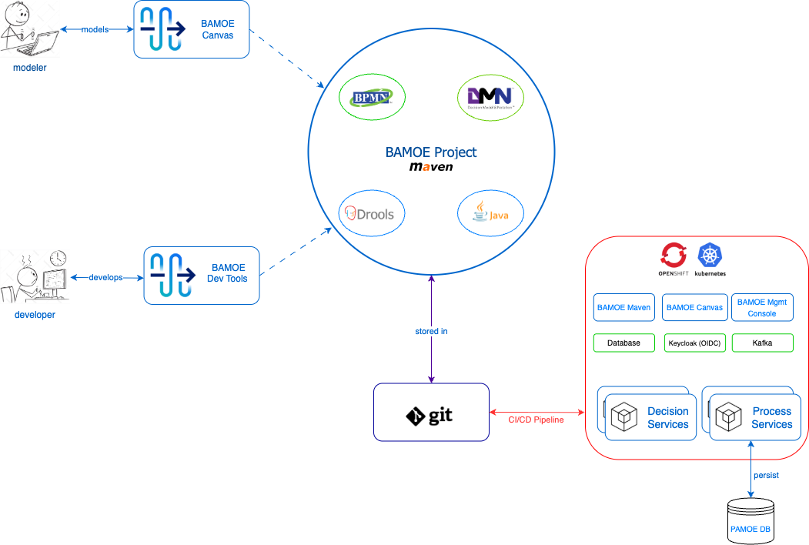

# IBM Business Automation Manager Open Editions (IBM BAMOE) Demos

# Overview
This repository includes a set of BAMOE demos, fully deployable and testable on Red Hat OpenShift or Kubernetes.

## Repository Modules
This is a multi-module repository, with the following modules:

### BAMOE Assets
The following public BAMOE assets are used for these demos:

- [**BAMOE Setup**](https://github.com/bamoe/bamoe-setup) contains setup instructions as well as jump-start scripts useful in setting up BAMOE on your local machine.
- [**BAMOE Maven**](https://github.com/bamoe/bamoe-maven) is a set of custom Maven Acclerators or Archetypes for creating projects for IBM Business Automation Manager Open Editions (BAMOE).
- [**BAMOE Business Service API**](https://github.com/bamoe/bamoe-business-service-api) is a set of Java API's for implementing BAMOE Classic or Embedded Mode business services

### Sharable Demo Projets
The following shared projects are available, in support of both Quarkus and Spring Boot demos:

- [**Sharable Fact Model**](./shared-fact-model) is a Maven library containing all shared Java classes, used by various demo projects.
- [**Watson Orchestrate & BAMOE**](./wxo-bamoe) is a combined demo of IBM Watson Orchestrate and BAMOE working in conjunction with each other.

### Quarkus Demo Projects
The following demos are based on the `IBM BAMOE Quarkus runtime`:

- [**Quarkus Classic Rules Service**](./quarkus-classic-rules-service) is an example of a classic-mode rules service, based on the Quarkus runtime.
- [**Quarkus Classic Decision Model Service**](./quarkus-classic-decision-model-service) is an example of a classic-mode decision (DMN) service, based on the Quarkus runtime.
- [**Quarkus Rules Service**](./quarkus-rules-service) is an example of a Kogito rules service, based on the Quarkus runtime.
- [**Quarkus Decision Model Service**](./quarkus-decision-model-service) is an example of a Kogito decision model (DMN) service, based on the Quarkus runtime.
- [**Quarkus Event Driven Rules Service**](./quarkus-event-driven-rules-service) is an example of a Kafka event-driven Kogito rules service, based on the Quarkus runtime.
- [**Quarkus Stateless (STP) Service**](./quarkus-stp-service) is an example of a Kogito stateless process service that utilizes straight-through-processing (STP) of external services, based on the Quarkus runtime.
- [**Quarkus Stateful Process Service**](./quarkus-process-service) is an example of a Kogito stateful process service that utilizes process engine persistence, using stateful BPMN, based on the Quarkus runtime.

### Spring Boot Demo Projects _(under construction)_
The following demos are based on the `IBM BAMOE Spring Boot runtime`:

- [**Spring Boot Classic Rules Service**](./springboot-classic-rules-service) is an example of a classic-mode rules service, based on the Spring Boot runtime.
- [**Spring Boot Classic Decision Model Service**](./springboot-classic-decision-model-service) is an example of a classic-mode decision (DMN) service, based on the Spring Boot runtime.
- [**Spring Boot Rules Service**](./springboot-rules-service) is an example of a Kogito rules service, based on the Spring Boot runtime.
- [**Spring Boot Decision Model Service**](./springboot-decision-model-service) is an example of a Kogito decision model (DMN) service, based on the Spring Boot runtime.
- [**Spring Boot Event Driven Rules Service**](./springboot-event-driven-rules-service) is an example of a Kafka event-driven Kogito rules service, based on the Spring Boot runtime.
- [**Spring Boot Stateless (STP) Service**](./springboot-stp-service) is an example of a Kogito stateless process service that utilizes straight-through-processing (STP) of external services, based on the Spring Boot runtime.
- [**Spring Boot Stateful Process Service**](./springboot-process-service) is an example of a Kogito stateful process service that utilizes process engine persistence, using stateful BPMN, based on the Spring Boot runtime.

## Architecture
The following diagram represents the typical, containerized architecture, for IBM BAMOE.  You will notice from the diagram below, there are only minimal infrastructure services required for decision-based applications.  You can choose to deploy `Maven` either a a container image or into your local `Artifactory` server as an off-line repository, or both.  If you wish to provide visual modeling capabilities to your developers or users, you can choose to deploy `BAMOE Canvas`.  No database or consoles are needed for decisions, however you can configure `Kafka` if your use cases include event-based decisioning.  Process-based applications require a database for process instance persistence, and you can deploy the DB and it's associated services as a container.  In addition, you can make the `BAMOE Management Console` available to your users as a container.  

## Additional Information (*Appendicies*)
This repository is focused on business automation using [**IBM Business Automation Manager Open Editions**](https://www.ibm.com/docs/en/ibamoe/9.3.x) products, specifically the IBM build of [**Kogito**](https://kogito.kie.org/) known as **IBM Decision Manager Open Edition (DMOE)** and **IBM Process Automation Manager Open Edition (PAMOE)**, leveraging [**Quarkus**](https://quarkus.io/) or [**Spring Boot**](https://spring.io/) as the assoicated container runtime.  The following online documentation is available in order to learn various aspects of these products and frameworks:

- [**IBM Watson Orchestrate**](https://www.ibm.com/products/watsonx-orchestrate)
Your AI tools are only as productive as the technology behind them. IBM® watsonx Orchestrate® brings all your AI agents together—making them more efficient, more collaborative and easier to scale across your business.

- [**Apache Maven**](https://maven.apache.org/) is a free and open source software project management and comprehension tool. Based on  the concept of a project object model (POM), Maven can manage a project’s build, reporting and documentation from a central piece of  information. A **getting started guide** is available [here](http://maven.apache.org/guides/getting-started/).

- [**Git**](https://git-scm.com//) is a free and open source distributed version control system designed to handle everything from small to very large projects with speed and efficiency. There is a **handbook** available [here](https://guides.github.com/introduction/git-handbook/), as well as various **guides** for learning and working with Git available [here](https://guides.github.com/)

- [**Quarkus**](https://quarkus.io/) - Traditional Java stacks were engineered for monolithic applications with long startup times and large memory requirements in a world where the cloud, containers, and Kubernetes did not exist. Java frameworks needed to evolve to meet the needs of this new world.  Quarkus was created to enable Java developers to create applications for a modern, cloud-native world. Quarkus is a Kubernetes-native Java framework tailored for GraalVM and HotSpot, crafted from best-of-breed Java libraries and standards. The goal is to make Java the leading platform in Kubernetes and serverless environments while offering developers a framework to address a wider range of distributed application architectures.  You can find a useful introdution to this technology at [**Getting Started with Quarkus**](https://quarkus.io/get-started/).

- [**Spring Boot**](https://spring.io/) - Spring makes programming Java quicker, easier, and safer for everybody. Spring’s focus on speed, simplicity, and productivity has made it the world's most popular Java framework.  Spring’s flexible libraries are trusted by developers all over the world. Spring delivers delightful experiences to millions of end-users every day.  Spring’s flexible and comprehensive set of extensions and third-party libraries let developers build almost any application imaginable.  Spring Boot transforms how you approach Java programming tasks, radically streamlining your experience. Spring Boot combines necessities such as an application context and an auto-configured, embedded web server to make microservice development a cinch. To go even faster, you can combine Spring Boot with Spring Cloud’s rich set of supporting libraries, servers, patterns, and templates, to safely deploy entire microservices-based architectures into the cloud, in record time.  You can find a useful introdution to this technology at [**Getting Started with Spring Boot**](https://spring.io/quickstart).
